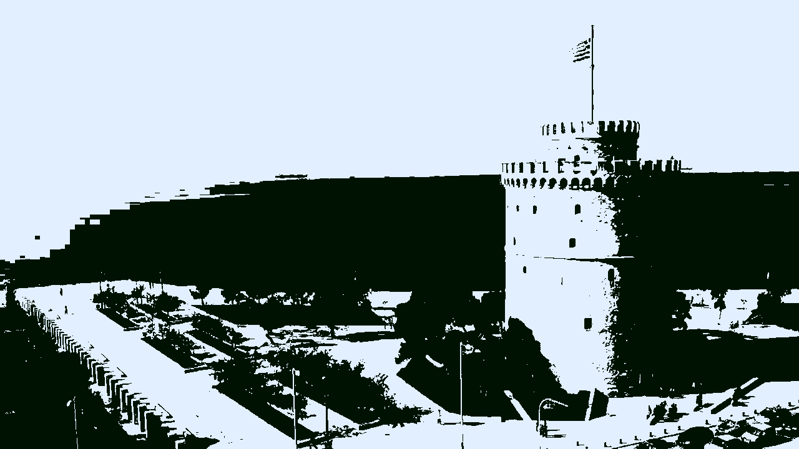
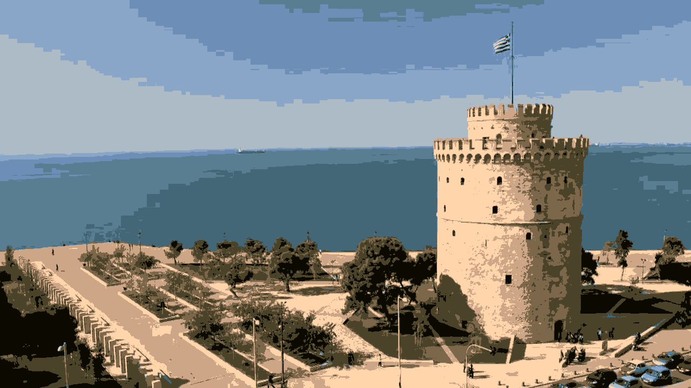

# Assignment 3 Writeup

This assignment add _Segmentation_ via *K-Means* and *SLIC* algorithms.

The algorithms will be briefly explained in each section, as well
as a summary of the results.

## Images

The results of this assignment use the `wt_slic.png` and `white-tower.png` images.  
  
Wt Slic  
  

White Tower  
  

## K-Means

### Algorithm Overview

1. Sample `k` points in the original image to use as seed cluster centers.  
2. For each point in the image, find closest cluster by RGB distance and associate them.  
3. For each cluster, recenter around the mean RGB value of all of it's points.  
4. If any of the centers have changed, loop back to step 2.  
5. Once all clusters are centered and points are in their closest cluster, 
overlay the image with the clusters as their mean RGB value.

### Results

2 Clusters (k = 2):  
  

4 Clusters (k = 4):  
  

10 Clusters (k = 10):  
  

### Analysis

The speed of the algorithm slows noticeably with more clusters, though even just two clusters
takes a few minutes. With fewer clusters, there are fewer distance operations that have to be
performed for each point.

The process used around 110 MB while processing an image of just 615 KB. 
Optimizations can definitely be made here.

## SLIC

### Algorithm Overview

### Results

### Analysis